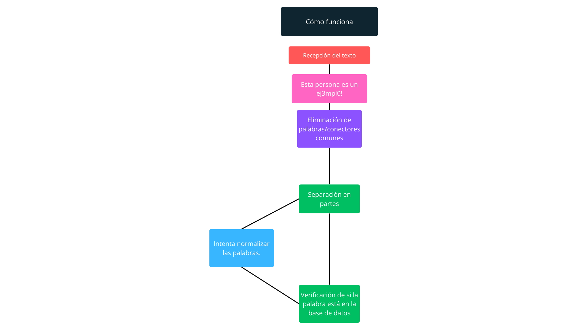

# Selector de Idioma 🌐

<table border=1>
  <tr>
    <td><a href="https://github.com/JaymeFernandes/Offense_Detector/blob/master/Algorithm/README.md">English</a></td>
    <td><a href="https://github.com/JaymeFernandes/Offense_Detector/blob/master/Algorithm/README_pt.md">Português</a></td>
    <td><a href="https://github.com/JaymeFernandes/Offense_Detector/blob/master/Algorithm/README_es.md">Español</a></td>
  </tr>
</table>

# Cómo funciona? 🧠

El algoritmo funciona de manera bastante simple, pasando por 5 procesos. 🔄

- Recepción del texto 📄
- Eliminación de palabras/conectores comunes ❌
- Separación en partes ➗
- Creación de 2 versiones de la palabra (intentando normalizar y normal). ✨
- Verificación de si la palabra está en la base de datos 📊

<br/>
<br/>



<br/>

# Eliminación de palabras/conectores comunes ❌

El algoritmo comienza eliminando palabras o conectores comunes como "a", "y", "o", "de", "del", etc.

Para reducir el número de verificaciones al final del proceso. 🚀

<br/>

- **Antes ⏰**
```
  Esta persona es un ej3mpl0!
```

- **Depois ⏰**
```
  Esta persona ej3mpl0
```

<br/>

### PT-BR:

<table border="1">
  <tr>
    <td>a</td>
    <td>o</td>
    <td>e</td>
    <td>é</td>
    <td>de</td>
    <td>do</td>
    <td>da</td>
    <td>dos</td>
    <td>das</td>
    <td>em</td>
    <td>na</td>
    <td>no</td>
    <td>nos</td>
    <td>nas</td>
    <td>um</td>
  </tr>
  <tr>
    <td>uma</td>
    <td>uns</td>
    <td>umas</td>
    <td>por</td>
    <td>para</td>
    <td>com</td>
    <td>como</td>
    <td>se</td>
    <td>mas</td>
    <td>mais</td>
    <td>menos</td>
    <td>ou</td>
    <td>ao</td>
    <td>aos</td>
    <td>à</td>
  </tr>
  <tr>
    <td>às</td>
    <td>onde</td>
    <td>quando</td>
    <td>porque</td>
    <td>que</td>
    <td>qual</td>
    <td>cujos</td>
    <td>cuja</td>
    <td>isto</td>
    <td>isso</td>
    <td>aquilo</td>
    <td>mesmo</td>
    <td>mesma</td>
    <td>mesmos</td>
    <td>mesmas</td>
  </tr>
  <tr>
    <td>também</td>
    <td>ainda</td>
    <td>muito</td>
    <td>muita</td>
    <td>muitos</td>
    <td>muitas</td>
    <td>ele</td>
    <td>ela</td>
    <td>eles</td>
    <td>elas</td>
    <td>você</td>
    <td>nós</td>
    <td>vossos</td>
    <td>vosso</td>
    <td>vos</td>
  </tr>
  <tr>
    <td>teu</td>
    <td>tua</td>
    <td>teus</td>
    <td>tuas</td>
    <td>meu</td>
    <td>minha</td>
    <td>meus</td>
    <td>minhas</td>
    <td>seu</td>
    <td>sua</td>
    <td>suas</td>
    <td>nem</td>
    <td>seja</td>
    <td>sendo</td>
    <td>outra</td>
  </tr>
  <tr>
    <td>outro</td>
    <td>dentre</td>
    <td>porém</td>
    <td>porque</td>
    <td>se</td>
    <td>senão</td>
    <td>entre</td>
    <td>sobre</td>
    <td>desde</td>
    <td>antes</td>
  </tr>
</table>

### EN

<table border="1">
  <tr>
    <td>and</td>
    <td>but</td>
    <td>or</td>
    <td>so</td>
    <td>yet</td>
    <td>for</td>
    <td>nor</td>
  </tr>
  <tr>
    <td>although</td>
    <td>however</td>
    <td>nevertheless</td>
    <td>therefore</td>
    <td>meanwhile</td>
    <td>consequently</td>
    <td>moreover</td>
  </tr>
  <tr>
    <td>furthermore</td>
    <td>likewise</td>
    <td>thus</td>
    <td>in</td>
    <td>otherwise</td>
    <td>as</td>
    <td>the</td>
  </tr>
  <tr>
    <td>for</td>
    <td>to</td>
    <td>a</td>
    <td>an</td>
    <td>of</td>
    <td>at</td>
    <td>by</td>
  </tr>
  <tr>
    <td>with</td>
    <td>from</td>
    <td>on</td>
    <td>upon</td>
    <td>between</td>
    <td>among</td>
    <td>under</td>
  </tr>
  <tr>
    <td>over</td>
    <td>above</td>
    <td>below</td>
    <td>into</td>
    <td>through</td>
    <td>during</td>
    <td>after</td>
  </tr>
  <tr>
    <td>before</td>
    <td>without</td>
    <td>since</td>
    <td>until</td>
    <td>along</td>
    <td>around</td>
    <td>about</td>
  </tr>
</table>

<br/>

# Separa en partes ➗

```
  Esta persona ej3mpl0
```

<table border="1">
  <tr>
    <td>Esta</td>
    <td>persona</td>
    <td>ej3mpl0</td>
  </tr>
</table>

<br/>

# Crea 2 versiones de la palabra (intentando normalizar y normal). ✨

El algoritmo utiliza las formas más comunes en que las personas reemplazan los caracteres de los textos por símbolos. 🔎

- **Normal**
```
  Esta persona ej3mpl0
```

- **Normalizada**
```
  Esta persona ejemplo
```

<br/>
<table border="1">
  <tr>
    <th>Caractere</th>
    <th>Correspondência</th>
  </tr>
  <tr>
    <td>4</td>
    <td>a</td>
  </tr>
  <tr>
    <td>@</td>
    <td>a</td>
  </tr>
  <tr>
    <td>8</td>
    <td>b</td>
  </tr>
  <tr>
    <td>(</td>
    <td>c</td>
  </tr>
  <tr>
    <td>3</td>
    <td>e</td>
  </tr>
  <tr>
    <td>€</td>
    <td>e</td>
  </tr>
  <tr>
    <td>9</td>
    <td>g</td>
  </tr>
  <tr>
    <td>6</td>
    <td>g</td>
  </tr>
  <tr>
    <td>#</td>
    <td>h</td>
  </tr>
  <tr>
    <td>1</td>
    <td>i</td>
  </tr>
  <tr>
    <td>!</td>
    <td>i</td>
  </tr>
  <tr>
    <td>|</td>
    <td>l</td>
  </tr>
  <tr>
    <td>Й</td>
    <td>n</td>
  </tr>
  <tr>
    <td>0</td>
    <td>o</td>
  </tr>
  <tr>
    <td>*</td>
    <td>o</td>
  </tr>
  <tr>
    <td>5</td>
    <td>s</td>
  </tr>
  <tr>
    <td>$</td>
    <td>s</td>
  </tr>
  <tr>
    <td>7</td>
    <td>t</td>
  </tr>
  <tr>
    <td>+</td>
    <td>T</td>
  </tr>
  <tr>
    <td>2</td>
    <td>z</td>
  </tr>
  <tr>
    <td>%</td>
    <td>z</td>
  </tr>
</table>

<br/>
<br/>

# Verifica si la palabra está en la base de datos 📊

Y finalmente, verifica si hay similitud entre alguna palabra de la base de datos con las palabras recibidas (normalizada y normal).

Utilizando 2 algoritmos:

-  Jaro-Winkler
-  Levenstein